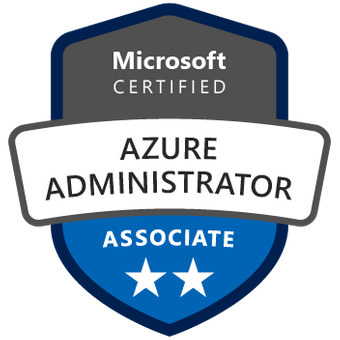

  

<h1 align="center">AZ-104 Certification Guide and DevOps Best Practices</h1>

  <a href="https://github.com/AnthonyByansi/AzureAdminPro/blob/main/LICENSE">

  A comprehensive repository for mastering the AZ-104 Microsoft Azure Administrator certification,  
  while integrating DevOps best practices, infrastructure as code, and industry insights.

## Getting Started

This repository is designed to provide you with comprehensive resources and practical examples to excel in the AZ-104 Microsoft Azure Administrator certification. Whether you're a beginner or looking to enhance your DevOps skills, you'll find valuable content tailored to your learning journey.

Please refer to the [Prerequisites](Prerequisites.md) section to ensure you have the required knowledge and tools before diving into the content.

## Contribution Guidelines

If you'd like to contribute to this repository, please read our [Contributing Guidelines](CONTRIBUTING.md) to understand how you can contribute, submit pull requests, and collaborate with the community

## License

This project is licensed under the [MIT License](LICENSE)
